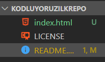

# Kodluyoruz Ilk Repo
Bu repo **Kodluyoruz** Front-end Eğitiminde oluşturduğumuz ilk repo. İçerisinde bir adet README dosyası, bir adet de index.html barındırıyor.
> 
# Installation
Öncelikle projeyi clonelayın.

>`git clone https://github.com/devyusss/kodluyoruzilkrepo.git`
# Usage
Projeyi cloneladıktan sonra Visual Studio Code programında açınız.
Linux için:
>`cd kodluyoruzilkrepo`
` code .`
# Contributing
Pul requestler kabul edilir. Büyük değişiklikler için, lütfen önce neyi değiştirmek istediğinizi tatışmak için konu açınız.
# License
[MIT](github.com/devyusss)